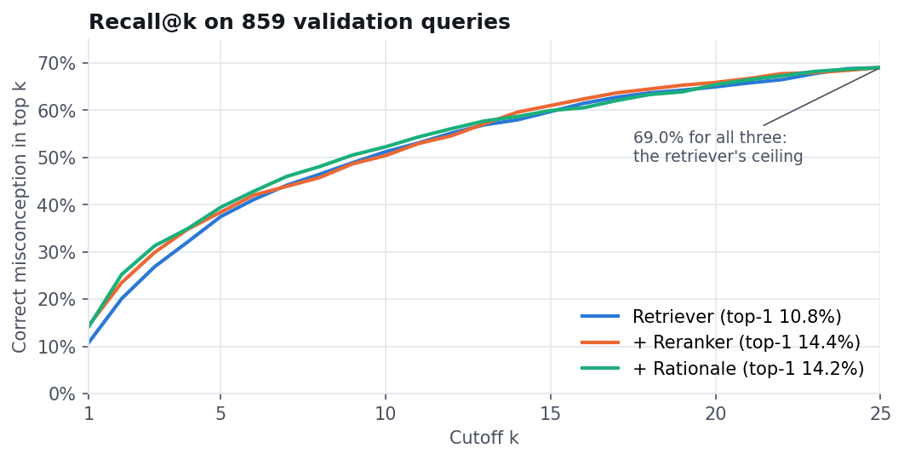
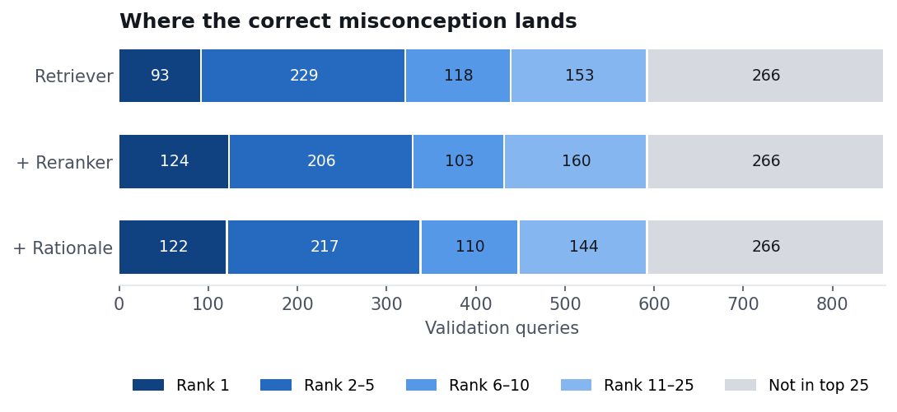
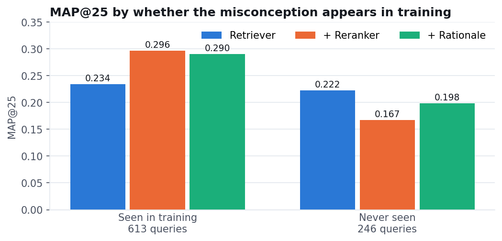
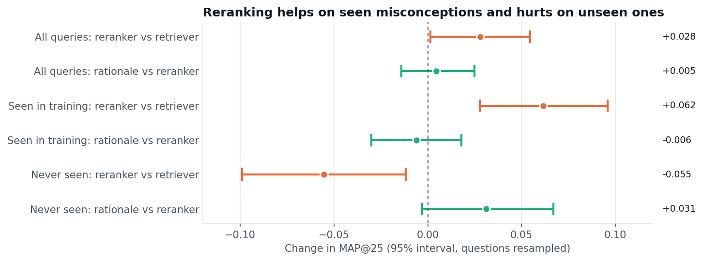
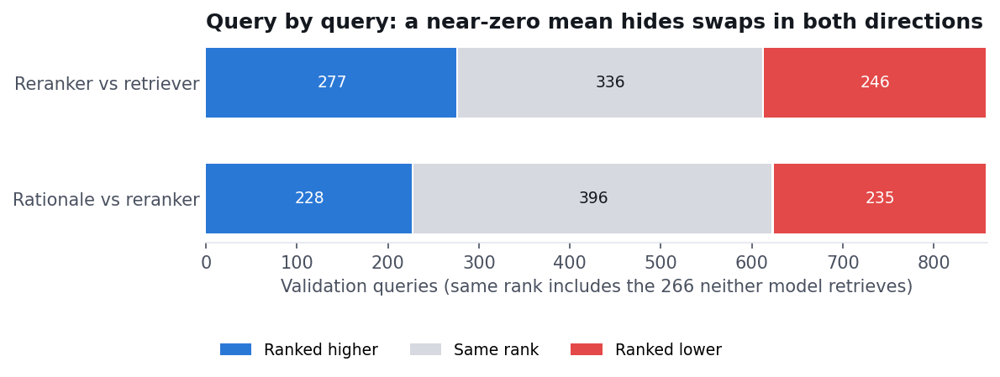
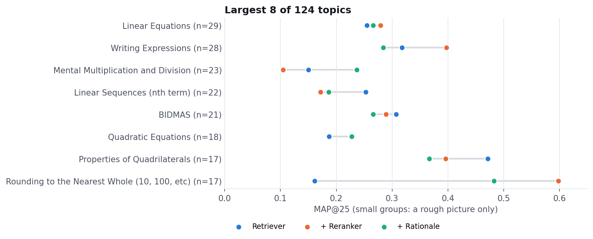

# Eedi Misconception Retrieval and Reranking Baseline

This repository implements a small retrieve-then-rerank reproduction of the
supplied Apply 3 brief. Each incorrect answer becomes a query containing the
question, the correct answer, and one distractor. The system retrieves up to 25
misconception descriptions, reranks those candidates, and reports MAP@25.

The optional ablation adds a teacher-generated, one-line description of the
likely reasoning error to the reranker input. The teacher prompt is label-blind
and the rationale cache is bound to its query text with a SHA-256 input hash.

## Results (scale B, 2026-10-03)

Validation split: 859 queries from 374 held-out questions. All three conditions share the same
retriever top-25 pools. Intervals are 95% paired-bootstrap intervals that resample whole questions,
because the wrong answers to one question are correlated.

| Condition | MAP@25 | Recall@25 | Δ vs. previous row (95% CI) |
|---|---:|---:|---|
| Retriever (bge-small-en-v1.5, 2 epochs) | 0.2309 | 0.6903 | — |
| + Reranker (ms-marco-MiniLM-L-6-v2, 1 epoch) | 0.2590 | 0.6903 | +0.028 [+0.001, +0.055] |
| + Teacher rationale (Qwen2.5-1.5B-Instruct) | 0.2636 | 0.6903 | +0.005 [−0.014, +0.025] |





### Seen vs. unseen misconceptions

246 validation queries (29%) need a misconception that never appears in the training split.

| Queries | n | Retriever | + Reranker | + Rationale | Reranker vs retriever | Rationale vs reranker |
|---|---:|---:|---:|---:|---|---|
| Seen in training | 613 | 0.234 | 0.296 | 0.290 | +0.062 [+0.028, +0.096] | −0.006 [−0.030, +0.018] |
| Never seen | 246 | 0.222 | 0.167 | 0.198 | −0.056 [−0.099, −0.012] | +0.031 [−0.003, +0.067] |





- Reranking reliably improves on retrieval overall, but only because it learns the training
  misconceptions: it helps on seen ones and **hurts on unseen ones**.
- The rationale lift is not distinguishable from zero overall. On unseen misconceptions it wins back
  about half the reranker's loss, with an interval that just touches zero. That is the most promising
  signal for a stronger (7B) teacher, not an established effect.
- Recall@25 is the ceiling: for 266 queries (31%) the gold misconception is not in the retriever's top
  25, and a reranker cannot recover them. The gold ranks first for 93 / 124 / 122 queries
  (retriever / reranker / rationale).
- The teacher was scaled down from the brief's Qwen2.5-7B to fit a 6 h budget on an 8 GiB RTX 4060
  Laptop GPU. The full run took 0.46 GPU hours.





Details are in [`results/`](results/): `metrics.json`, `analysis.json` (rank bins, recall curve,
seen/unseen, per-query wins and losses, topics, example rationales), and `report.html`, a
self-contained page of charts. Recompute the analysis with `python -m scripts.analyze_results`, then
redraw these figures with `python -m scripts.plot_results`.
[`DEVLOG.md`](DEVLOG.md) is the process record.

Untested next steps: a stronger retriever (it sets the ceiling), more reranker epochs, and the 7B
teacher, judged on unseen misconceptions in particular.

To reproduce the whole run unattended, use `scripts/queue_apply3.ps1`. It downloads the data,
waits for a free GPU, trains, evaluates, and commits the results.

See [`docs/experiment-design.md`](docs/experiment-design.md) for the model and evaluation choices.

The surrounding `Distill` workspace contains a separate Apply 2 project. This
repository is nested in its own `eedi-baseline/` directory so that project is
preserved and excluded from the Eedi push.

## Install

On the observed Windows/CUDA machine:

```powershell
.\scripts\setup_windows.ps1
```

On a CUDA Linux host:

```bash
bash scripts/setup_linux.sh
```

For a CPU-only environment, create a virtual environment, install
`requirements-cpu.txt`, then install the project without re-resolving the
platform-specific PyTorch wheel:

```bash
python -m venv .venv
python -m pip install -r requirements-cpu.txt
python -m pip install --no-deps -e .
```

The setup scripts pin Python dependencies and select the PyTorch wheel for the
CUDA 12.1 or CPU path. Model weights are downloaded on the first training or
rationale-generation command and are not included in Git.

## Prepare competition data

Obtain the files from the [official Kaggle competition](https://www.kaggle.com/competitions/eedi-mining-misconceptions-in-mathematics)
under its terms. Place `train.csv`, `test.csv`, and `misconception_mapping.csv`
in `data/raw/`; no Kaggle credentials or competition data are included here.

```powershell
.\.venv\Scripts\python.exe -m scripts.prepare_data `
  --train data/raw/train.csv `
  --test data/raw/test.csv `
  --mapping data/raw/misconception_mapping.csv `
  --output-dir data/processed `
  --validation-fraction 0.2 `
  --seed 42
```

The command validates headers and labels, makes one row per wrong answer,
keeps all distractors from a question on one side of the split, writes a
label-free test JSONL, and saves source file hashes in
`data/processed/manifest.json`.

## Train and evaluate

From the repository root, train the compact retriever and then the cross
encoder:

```powershell
.\.venv\Scripts\python.exe -m scripts.train_retriever `
  --train data/processed/train.jsonl `
  --output-dir models/retriever

.\.venv\Scripts\python.exe -m scripts.train_reranker `
  --train data/processed/train.jsonl `
  --catalog data/processed/catalog.json `
  --retriever models/retriever `
  --output-dir models/reranker

.\.venv\Scripts\python.exe -m scripts.evaluate `
  --validation data/processed/validation.jsonl `
  --catalog data/processed/catalog.json `
  --retriever models/retriever `
  --reranker models/reranker `
  --output-dir outputs/validation
```

Evaluation saves matched retrieval and reranker MAP@25/Recall@25, ranked
candidate IDs and scores, model/data hashes, runtime metadata, and
`outputs/validation/report.md`. The reranker can only reorder candidates in the
retriever's top-25 pool; it cannot introduce a missing candidate.

## Optional rationale ablation

Generate separate, label-blind caches for the training and validation queries.
The 7B teacher may not fit in the local 8 GiB GPU; use a larger host if it runs
out of memory.

```powershell
.\.venv\Scripts\python.exe -m scripts.generate_rationales `
  --input data/processed/train.jsonl `
  --output data/cache/rationales_train.jsonl

.\.venv\Scripts\python.exe -m scripts.generate_rationales `
  --input data/processed/validation.jsonl `
  --output data/cache/rationales_validation.jsonl

.\.venv\Scripts\python.exe -m scripts.train_reranker `
  --train data/processed/train.jsonl `
  --catalog data/processed/catalog.json `
  --retriever models/retriever `
  --rationales data/cache/rationales_train.jsonl `
  --output-dir models/reranker_rationale

.\.venv\Scripts\python.exe -m scripts.evaluate `
  --validation data/processed/validation.jsonl `
  --catalog data/processed/catalog.json `
  --retriever models/retriever `
  --reranker models/reranker `
  --rationale-reranker models/reranker_rationale `
  --rationales data/cache/rationales_validation.jsonl `
  --output-dir outputs/validation_with_rationale
```

Keep the split, retriever candidate pools, and evaluation code fixed when
comparing the baseline and rationale rerankers. The rationale path rejects
missing, duplicate, unexpected, or stale query cache entries.

## Verify the code

```powershell
python -m unittest discover -s tests -v
python -m compileall -q eedi_baseline scripts
```

The tests use small hand-checked fixtures and do not download models or
competition data. Full model training and measured MAP@25 results remain
pending valid competition data and a completed run.
